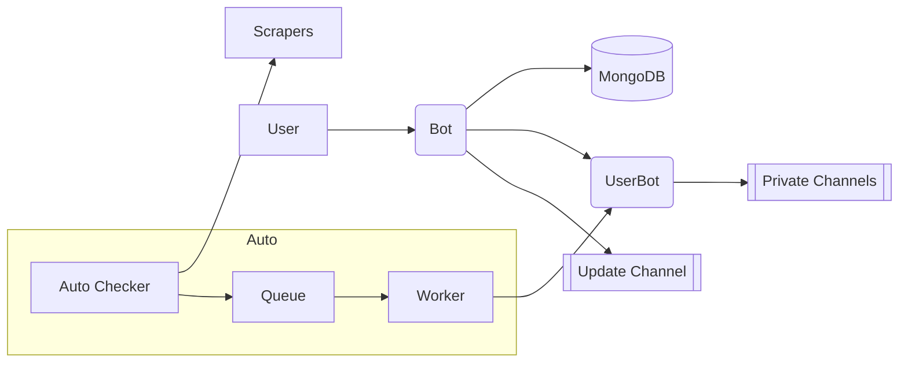
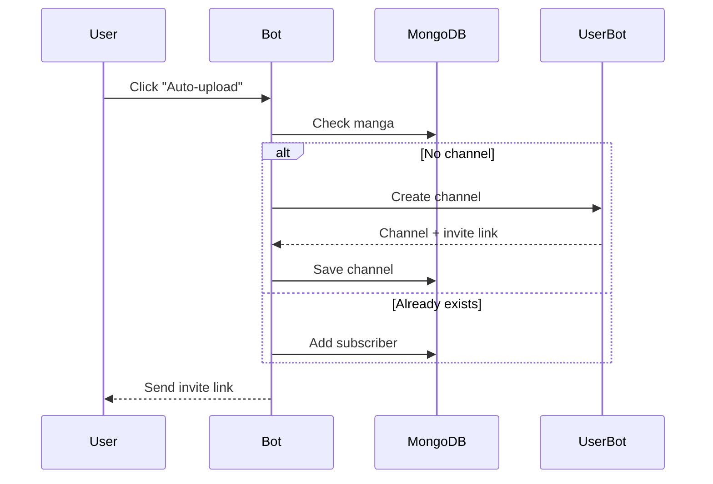
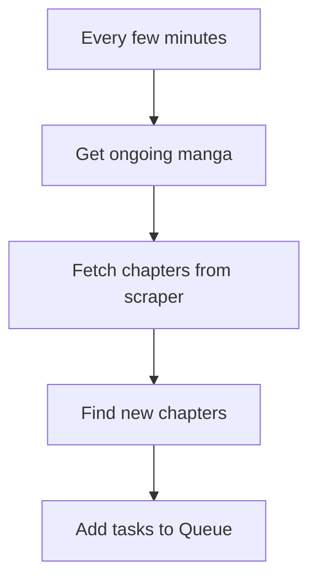
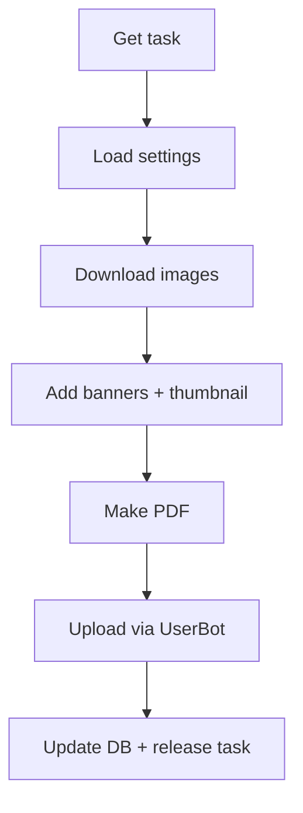

# Auto-Manga System – Simple Overview  

## Parts
- **Bot** – Handles user commands, DB  
- **UserBot** – Creates channels, uploads  
- **MongoDB** – Stores manga + users  
- **Scrapers** – Get chapters + images  
- **Queue** – Holds upload tasks  
- **Auto Checker** – Finds new chapters  
- **Worker** – Downloads → Converts → Uploads  

---

## Data Example (`manga_channels`)
```json
{
  "manga_id": "abc123",
  "title": "One Piece",
  "channel_id": -10012345678,
  "invite_link": "t.me/+something",
  "last_chapter": 1120,
  "status": "ongoing",
  "url": "https://...",
  "sf": "ck",
  "owner_id": 12345678
}
````

---

## System Overview



---

## Flow 1: Enable Auto-Upload



---

## Flow 2: Auto Checker



---

## Flow 3: Upload Worker



---

## Notes

* Each manga has a stable `manga_id` (hash of URL).
* Queue is locked per channel (no duplicate uploads).
* Admin commands:

  * `/force_check <id>` → scan now
  * `/mark_complete <id>` → mark finished
---
